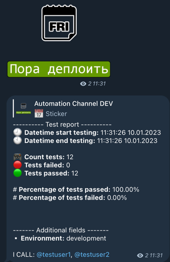

# pytest-telegram-notifier

[](https://badge.fury.io/py/pytest-telegram-notifier)
[](https://results.pre-commit.ci/latest/github/PlagerX-Group/pytest-telegram-notifier/main)
[](https://github.com/psf/black)
[](https://www.codetriage.com/plagerx-group/pytest-telegram-notifier)


#### To activate the plugin, you must use the parameter
```text
--telegram-notifier
```

#### Custom path or configuration file name
```text
--telegram-notifier-config-file <custom-path>
```

#### An example of plugin configuration:
```ini
[Telegram]
chat-id: -99999999

```

#### Environment variables
```text
TELEGRAM_ACCESS_TOKEN=<access-token>
```

#### An example of Telegram message

